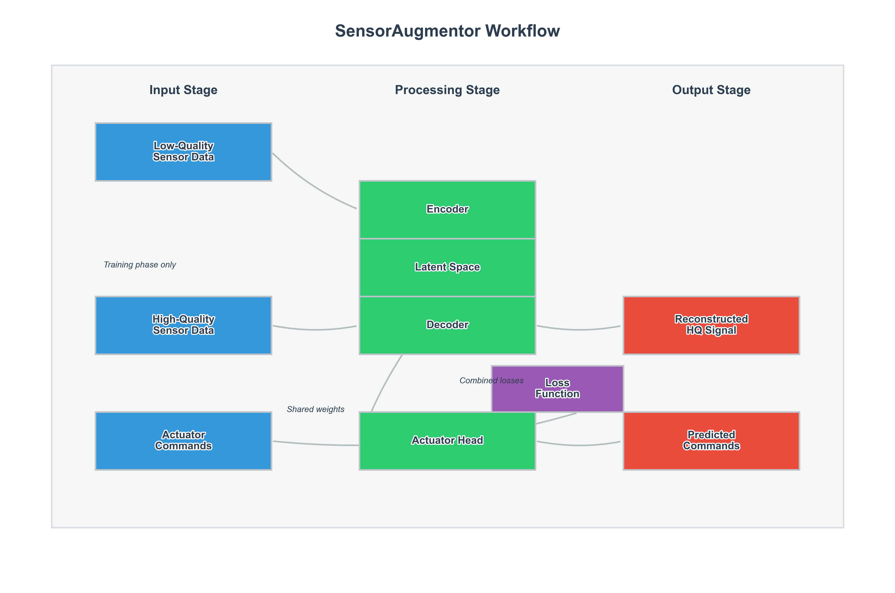

# SensorAugmentor Documentation

Welcome to the SensorAugmentor documentation. This comprehensive guide will help you understand and utilize the SensorAugmentor framework for enhancing low-quality sensor data and generating precise actuator control commands.

## Overview

SensorAugmentor is a deep learning framework designed to transform low-quality sensor signals into high-quality representations and simultaneously predict appropriate actuator commands. The framework leverages neural networks with residual connections to learn the mapping between noisy, low-resolution sensor data and their high-fidelity counterparts.



Key capabilities include:

- **Signal Enhancement**: Clean and restore degraded sensor signals
- **Feature Extraction**: Learn meaningful latent representations of sensor data
- **Actuator Control**: Generate optimal control commands for actuators
- **Multi-objective Optimization**: Balance multiple learning objectives

## Table of Contents

- **Getting Started**
  - [Installation Guide](#installation)
  - [Quickstart](#quickstart)
  - [Basic Concepts](tutorials/basic_concepts.md)

- **Tutorials**
  - [Signal Enhancement with SensorAugmentor](tutorials/signal_enhancement.md)
  - [Actuator Command Prediction](tutorials/actuator_command_prediction.md)
  - [Working with Custom Sensor Data](tutorials/custom_sensor_data.md)
  - [Multi-sensor Fusion](tutorials/multi_sensor_fusion.md)

- **API Reference**
  - [Core Components](api/index.md#core-components)
  - [Training Functions](api/index.md#training-functions)
  - [Advanced Components](api/index.md#advanced-components)
  - [Utility Functions](api/index.md#utility-functions)

- **Architecture**
  - [Design Philosophy](architecture/index.md#design-philosophy)
  - [System Architecture](architecture/index.md#system-architecture)
  - [Core Components](architecture/index.md#core-components)
  - [Data Flow](architecture/index.md#data-flow)
  - [Model Architecture](architecture/index.md#model-architecture)
  - [Extension Points](architecture/index.md#extension-points)

- **Deployment**
  - [Model Export](deployment/index.md#model-export)
  - [Containerized Deployment](deployment/index.md#containerized-deployment)
  - [Cloud Deployment](deployment/index.md#cloud-deployment)
  - [Edge Deployment](deployment/index.md#edge-deployment)
  - [API Development](deployment/index.md#api-development)

- **Troubleshooting**
  - [Installation Issues](troubleshooting/index.md#installation-issues)
  - [Training Issues](troubleshooting/index.md#training-issues)
  - [Model Performance Issues](troubleshooting/index.md#model-performance-issues)
  - [Deployment Challenges](troubleshooting/index.md#deployment-challenges)

- **Contributing**
  - [How to Contribute](../CONTRIBUTING.md)
  - [Development Guidelines](../CONTRIBUTING.md#coding-standards)
  - [Testing Guidelines](../CONTRIBUTING.md#testing)

## Installation

SensorAugmentor requires Python 3.8 or later and PyTorch 1.9 or later.

### Standard Installation

```bash
pip install sensor-augmentor
```

### Development Installation

```bash
git clone https://github.com/yourusername/SensorAugmentor.git
cd SensorAugmentor
pip install -e .
```

### Platform-Specific Notes

**Windows**:
```bash
# Ensure you have the correct PyTorch version for your CUDA setup
pip install torch==1.13.1+cu117 -f https://download.pytorch.org/whl/torch_stable.html
pip install sensor-augmentor
```

**Linux/Ubuntu**:
```bash
# Install system dependencies
sudo apt-get update
sudo apt-get install -y python3-dev libopenblas-dev
pip install sensor-augmentor
```

**macOS**:
```bash
# For Apple Silicon (M1/M2)
pip install torch==1.13.0 -f https://download.pytorch.org/whl/torch_stable.html
pip install sensor-augmentor
```

## Quickstart

Here's a simple example to get you started with SensorAugmentor:

```python
import torch
from torch.utils.data import DataLoader
from sensor_actuator_network import SensorAugmentor, SyntheticSensorDataset

# Create synthetic dataset (replace with your own data)
dataset = SyntheticSensorDataset(num_samples=1000, sensor_dim=32, output_dim=4)
train_loader = DataLoader(dataset, batch_size=64, shuffle=True)

# Create model
model = SensorAugmentor(sensor_dim=32, hidden_dim=64, output_dim=4, num_resblocks=2)

# Train model
optimizer = torch.optim.Adam(model.parameters(), lr=1e-3)
for epoch in range(10):
    for x_lq, x_hq, y_cmd in train_loader:
        # Forward pass
        reconstructed_hq, act_command, encoded_lq, encoded_hq = model(x_lq, x_hq)
        
        # Calculate loss
        # ... (see tutorials for complete example)
        
        # Backward pass and optimize
        optimizer.zero_grad()
        loss.backward()
        optimizer.step()

# Use the trained model
with torch.no_grad():
    # Forward pass with just low-quality input
    x_lq_sample = torch.randn(1, 32)  # Single sample, 32 dimensions
    reconstructed_hq, actuator_command, _, _ = model(x_lq_sample)
    
    print("Enhanced signal shape:", reconstructed_hq.shape)
    print("Actuator command:", actuator_command)
```

## Citing SensorAugmentor

If you use SensorAugmentor in your research, please cite it using the following BibTeX entry:

```bibtex
@software{sensoraugmentor2023,
  author = {Your Name},
  title = {SensorAugmentor: A Framework for Enhancing Sensor Signals},
  url = {https://github.com/yourusername/SensorAugmentor},
  version = {0.1.0},
  year = {2023},
}
```

## License

SensorAugmentor is released under the MIT License. See [LICENSE](../LICENSE) for details.

## Support

For questions, issues, or feature requests, please [open an issue](https://github.com/yourusername/SensorAugmentor/issues) on GitHub. 